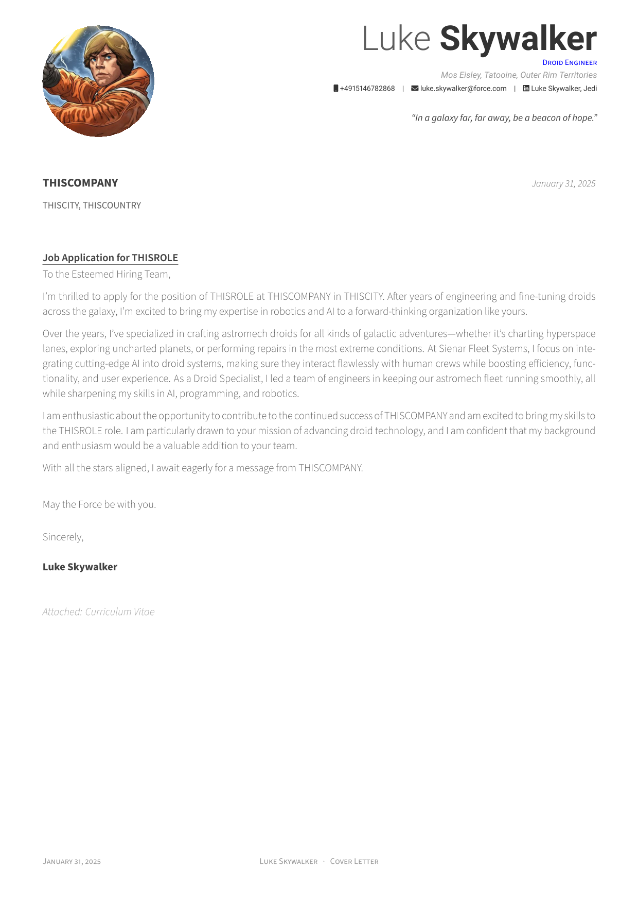

# cover-letter-generator

Automate the generation of cover letters using:

- **Tkinter**: For building a GUI that enables seamless customization for different job offerings.
- **Python**: To process inputs, dynamically fill LaTeX templates, and automate PDF generation.
- **LaTeX**: For formatting and producing a high-quality PDF output.

## How to Run

Run the following command to generate your cover letter:

```bash
python main.py
```

## Files to Edit

- `templates/coverletter.tex`: This is the LaTeX template for the cover letter.
- `templates/letter.tex`: You can modify the structure and content of the cover letter in this file. The placeholders in this template will be replaced with the input from the Tkinter form.
- `templates/personal-data.tex`: Input your personal details here, such as your name, address, and email address. This file contains placeholders for your data, which will be used to generate the cover letter.

## GUI


## Cover Letter Preview

Once you've generated your cover letter, you can view the result in the pdf folder.
This gives you an idea of how the generated cover letter looks like: [View Cover Letter PDF](pdf/coverletter.pdf)


